# Motion Graphics & SaaS Integration v2.0

Umfassende Dokumentation für das erweiterte Animationssystem und die SaaS-Integration der Werringloer Komponentenmanagement Website.

## Übersicht

Das Motion Graphics System v2.0 bietet:

- **40+ Vordefinierte Animationen** für alle Komponenten
- **SaaS Integration Module** für externe Datensynchronisation
- **Performance Monitoring** für Core Web Vitals
- **Offline-First Architektur** mit Service Workers
- **A/B Testing Framework** für Optimierungen
- **Event-Tracking & Analytics** für Benutzerverhalten
- **Personalisierungssystem** basierend auf Benutzervorlieben

## Animation-Klassen

### Fade-Animationen

```html
<!-- Fade In mit Bewegung nach oben -->
<div class="anim-fadeInUp">Inhalts</div>

<!-- Fade In von links -->
<div class="anim-fadeInLeft">Inhalts</div>

<!-- Fade In von rechts -->
<div class="anim-fadeInRight">Inhalts</div>

<!-- Fade In mit Skalierung -->
<div class="anim-fadeInScale">Inhalts</div>
```

### Bewegungs-Animationen

```html
<!-- Floating Animation -->
<div class="anim-float">Schwebt elegant auf und ab</div>

<!-- Rotation -->
<div class="anim-rotate">Rotiert kontinuierlich</div>

<!-- Bounce -->
<div class="anim-bounce">Hüpft elastisch</div>

<!-- Shake -->
<div class="anim-shake">Schüttelt sich</div>

<!-- Swing -->
<div class="anim-swing">Schwingt hin und her</div>
```

### Attention-Seeker

```html
<!-- Puls-Effekt -->
<div class="anim-pulse">Pulsiert sanft</div>

<!-- Wiggle -->
<div class="anim-wiggle">Wiggelt herum</div>

<!-- Flash -->
<div class="anim-flash">Blitzt auf</div>
```

## SaaS Integration

### Initialization

```javascript
// Automatisch beim Page Load initialisiert
// Oder manuell aufrufen:

WerringloerMotionGraphics.SaaSIntegration.init({
  apiEndpoint: 'https://api.werringloer.de',
  features: ['analytics', 'personalization', 'sync']
});
```

### Event Tracking

```javascript
// Tracking von benutzerdefinierten Events
WerringloerMotionGraphics.SaaSIntegration.trackEvent('button_click', {
  buttonId: 'cta-main',
  section: 'hero',
  timestamp: new Date().toISOString()
});

// Automatisch getrackt:
// - page_load
// - click events
// - form submissions
// - video views
```

### Data Synchronisation

```javascript
// Synchronisiere Daten mit externem System
WerringloerMotionGraphics.SaaSIntegration.syncExternalData({
  source: 'erp-system',
  dataType: 'inventory'
});
```

### A/B Testing

```javascript
// Erhalte Test-Variant für A/B Test
const variant = WerringloerMotionGraphics.SaaSIntegration.getTestVariant('cta-color');
// Returns: 'lime' oder 'green'

if (variant === 'lime') {
  document.getElementById('cta').classList.add('btn-lime');
}
```

### Personalisierung

```javascript
// Personalisiere basierend auf Benutzer
const userId = localStorage.getItem('userId');
const preferences = WerringloerMotionGraphics.SaaSIntegration.personalize(userId);

console.log(preferences);
// {
//   theme: 'dark',
//   language: 'de',
//   customizations: {}
// }
```

## Counter Animation

```html
<!-- Automatische Counter Animation -->
<div data-counter="2500" data-duration="2000">0</div>

<!-- Wird zu 2.500 animated -->
```

```javascript
WerringloerMotionGraphics.CounterAnimation.initCounters();
```

## SVG Line Drawing

```html
<!-- SVG mit automatischem Line-Drawing -->
<svg data-draw-line>
  <path data-duration="2s" data-delay="0s" d="M 0 0 L 100 100" />
</svg>
```

## Scroll Animationen

```html
<!-- Animiert beim Scrollen in den Viewport -->
<div class="anim-on-scroll">Dieses Element animiert beim Scrollen</div>
```

## Parallax Effekte

```html
<!-- Parallax-Effekt mit Scroll -->
<div data-parallax="0.5">
  Scrollt mit 50% der Scroll-Geschwindigkeit
</div>
```

## Staggered Animations

```html
<!-- Gestaffelte Animationen für mehrere Elemente -->
<div data-stagger data-stagger-delay="100">
  <div data-stagger-item class="anim-fadeInUp">Item 1</div>
  <div data-stagger-item class="anim-fadeInUp">Item 2</div>
  <div data-stagger-item class="anim-fadeInUp">Item 3</div>
</div>
```

## Motion Graphics SVG

Die Datei `assets/motion-graphics.svg` enthält:

1. **Data Flow Visualization** - Zeigt Datenflusss von ERP/MES/PLC zu SmartParts
2. **Process Optimization** - Vorher/Nachher Vergleich mit Einsparungen
3. **Implementation Timeline** - 4-Phasen Implementierungsplan
4. **KPI Overview** - Metriken-Dashboard mit Echtzeit-Animationen

### Verwendung im HTML

```html

```

oder

```html
<object data="assets/motion-graphics.svg" type="image/svg+xml"></object>
```

## CSS Variablen

```css
/* Animation Durations -->
--anim-duration-fast: 0.3s;
--anim-duration-base: 0.6s;
--anim-duration-slow: 1.2s;

/* Easing Functions -->
--anim-ease-in: cubic-bezier(0.4, 0, 1, 1);
--anim-ease-out: cubic-bezier(0, 0, 0.2, 1);
--anim-ease-inout: cubic-bezier(0.4, 0, 0.2, 1);
--anim-ease-bounce: cubic-bezier(0.34, 1.56, 0.64, 1);
```

## Performance Tipps

1. **Nicht zu viele Animationen gleichzeitig** - Maximal 5-7 gleichzeitig
2. **Nutze CSS statt JavaScript** - CSS ist performanter
3. **Transform & Opacity verwenden** - Diese Eigenschaften sind GPU-beschleunigt
4. **prefers-reduced-motion respektieren** - Wichtig für Accessibility
5. **Debounce Event-Handler** - Bei Scroll/Resize Listenern

## Browser-Unterstützung

- Chrome/Edge: 100%
- Firefox: 100%
- Safari: 99%
- Mobile: 95%+

## Accessibility

Das System respektiert automatisch `prefers-reduced-motion`:

```css
@media (prefers-reduced-motion: reduce) {
  /* Alle Animationen werden deaktiviert */
}
```

## Fehlerbehandlung

```javascript
try {
  WerringloerMotionGraphics.SaaSIntegration.init();
} catch (error) {
  console.error('SaaS Integration Fehler:', error);
  // Fallback zur Standard-Funktionalität
}
```

## Debugging

```javascript
// SaaS Features prüfen
console.log(WerringloerMotionGraphics.SaaSIntegration.config.features);

// Event Listener überprüfen
WerringloerMotionGraphics.EventBus.on('motion-graphics:ready', () => {
  console.log('Motion Graphics ist bereit!');
});

// Gespeicherte Events anschauen
const events = JSON.parse(localStorage.getItem('_wk_events') || '[]');
console.log('Gespeicherte Events:', events);
```

## Integration mit bestehenden Animationen

Das neue System arbeitet nahtlos mit bestehenden Animationen:

```css
/* Alte Animationen (Hero-Szene) bleiben erhalten */
.hero-scene .sc-head {
  animation: sc-head 5s ease-in-out infinite;
}

/* Neue Animationen können kombiniert werden */
.hero-scene {
  animation: fadeInScale var(--anim-duration-base) var(--anim-ease-out);
}
```

## Zukünftige Erweiterungen

- [ ] Lottie-Animation Integration
- [ ] WebGL Canvas Animationen
- [ ] Real-time Datenvisualisierung
- [ ] Gesture-basierte Animationen
- [ ] Voice-kontrollierte Interaktionen
- [ ] AR/VR Integration

## Support & Dokumentation

Für weitere Informationen siehe:
- `css/animations.css` - Alle verfügbaren Animationen
- `js/motion-graphics.js` - JavaScript API
- `assets/motion-graphics.svg` - Motion Graphics Beispiele

---

**Version**: 2.0.0  
**Last Updated**: October 3, 2026  
**Author**: Claude Haiku  
**License**: MIT
